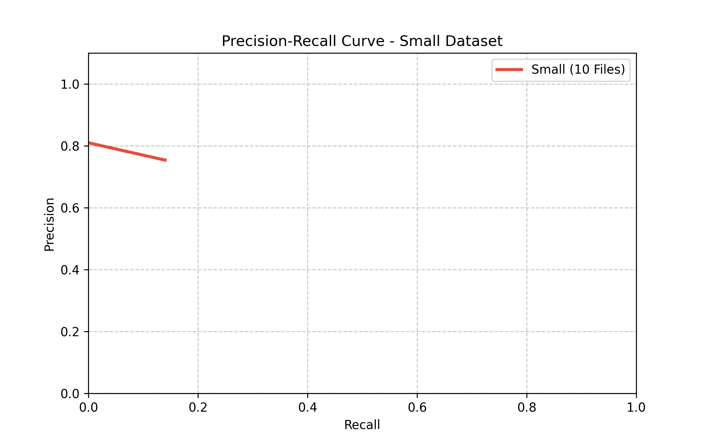
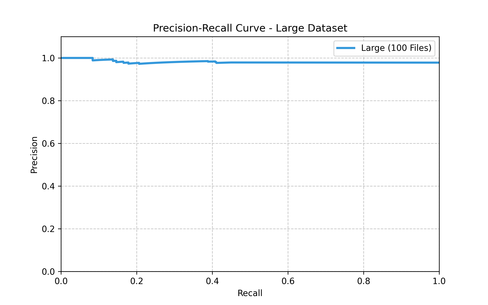

# Distributed Systems Programming – Assignment 3
## DIRT: Discovery of Inference Rules from Text
### Hadoop MapReduce Implementation on AWS EMR

============================================================

STUDENT INFO

Khaled Saleh      ID: 326801628   username: khaleds
Mostafa Taha      ID: 326524675   username: mostafat
Osama Najjar      ID: 325227767   username: osaman

============================================================

0) SUBMISSION CONTENTS

- Source code (Java + pom.xml)
- This README (includes full Design + Analysis)
- Output files for frontal check:
  * MI(p,slot,w)
  * Similarity scores for test-set predicate pairs

============================================================

1) PROJECT OVERVIEW

Goal:
Implement a scalable MapReduce version of DIRT (Dekang Lin & Patrick Pantel)
to discover lexico-syntactic inference rules from large corpora and evaluate
predicate similarity using Mutual Information (MI).

DIRT discovers inference rules such as:
    X acquire Y  ⇔  X purchase Y

Core idea:
Two dependency paths are similar if they occur with similar arguments.
Each path is represented as an MI-weighted feature vector over (slot,word),
and similarity is computed using cosine similarity.

Key Assignment Requirements:
- Scalable MapReduce design
- Dependency paths from Stanford biarcs
- MI(p,slot,w) computation
- Similarity computation on test set
- Design report + Analysis report + graphs

============================================================

2) DATA SOURCES

Corpus:
- Google Syntactic N-Grams (Biarcs format)
- Stanford Dependencies
- Uploaded by students to personal S3 buckets

Test Set:
- Predicate pairs with labels POSITIVE / NEGATIVE
- Provided by Omer Levy
- Used only for evaluation

============================================================

3) PRE-PROCESSING CONSTRAINTS

According to the paper and assignment:

- Only verb-headed dependency paths are used
- X and Y slots must be nouns
- Dependency paths include prepositions (IN, TO)
- Auxiliary verbs (is, are, was, be, etc.) are filtered
- Corpus words are stemmed (Porter Stemmer)

Stemming is required because corpus words are not lemmatized,
while test-set predicates are given in base form.

============================================================

4) SYSTEM PIPELINE OVERVIEW

The system is implemented as FOUR MapReduce jobs:

1. Dependency Path Extraction & Counting
2. Mutual Information (MI) Computation
3. Similarity Computation (Cosine)
4. Final Aggregation

All stages are fully distributed and scalable.

============================================================

5) PROJECT STRUCTURE (CODE MAP)

Main:
- DirtJob.java        : orchestrates the multi-job Hadoop pipeline
- EmrRunner.java      : configures and runs the pipeline on AWS EMR

MapReduce steps:
- Step 1: DirtMapper.java / DirtReducer.java
- Step 2: MiMapper.java   / MiReducer.java
- Step 3: SimMapper.java  / SimReducer.java
- Step 4: SumMapper.java  / SumReducer.java

Utility:
- Stemmer.java (Porter Stemmer)

============================================================

6) MAPREDUCE DESIGN (VERY DETAILED)

------------------------------------------------------------
JOB 1 – PATH / SLOT / WORD EXTRACTION + COUNTING
------------------------------------------------------------

Goal:
Extract dependency paths and count occurrences of (path,slot,word).

Mapper:
- Input : one biarc record
- Output:
    Key   = (path, slot, word)
    Value = 1

Reducer:
- Input : (path,slot,word) → [1,1,1,...]
- Output:
    Key   = (path, slot, word)
    Value = total_count

KV Pairs:
- One KV per extracted dependency observation
- Number of keys equals number of unique triples

Memory:
- Reducer memory O(1) per key (streaming sum)

------------------------------------------------------------
JOB 2 – MUTUAL INFORMATION COMPUTATION
------------------------------------------------------------

MI(p,s,w) = log( |p,s,w| * N / ( |p,s,*| * |*,*,w| ) )

Goal:
Compute MI(p,slot,w) using counts and marginals.

Mapper:
- Input : (path,slot,word,count)
- Output:
    Key   = path
    Value = (slot, word, count)

Reducer:
- Receives all slot-word pairs for a path
- Computes required marginals
- Computes MI according to DIRT formula

Output:
    path    slot    word    MI

Memory:
- Reducer holds all features for one path
- Worst-case memory proportional to number of slot-word pairs
- Path skew is the main memory risk

Worst-case memory complexity per reducer: O(F), where F is number of slot-word features for a path.

------------------------------------------------------------
JOB 3 – SIMILARITY COMPUTATION
------------------------------------------------------------

Goal:
Compute similarity between predicate pairs in the test set.

Mapper:
- Key   = predicate1|predicate2
- Value = partial dot products / partial norms

Reducer:
- Aggregates partials
- Computes cosine similarity

Output:
    predicate1    predicate2    GOLD_LABEL    similarity_score

Memory:
- Constant per key

------------------------------------------------------------
JOB 4 – FINAL AGGREGATION
------------------------------------------------------------

Goal:
Aggregate partial similarity contributions into final scores.
Reducer sums partial dot products and norm contributions to compute final cosine similarity.

============================================================

7) HOW TO RUN (WITH TODO PLACES)

------------------------------------------------------------
7.1 Prerequisites
------------------------------------------------------------

- Java 8+
- Maven
- AWS CLI configured
- An S3 bucket you control

------------------------------------------------------------
7.2 S3 PATHS (FILL THESE)
------------------------------------------------------------

S3_BUCKET                = mostafa-ass3-bucket
CORPUS_LARGE_PREFIX      = s3://mostafa-ass3-bucket/input/biarcs-large/
TESTSET_PATH             = s3://mostafa-ass3-bucket/test-set/
JAR_PATH                 = s3://mostafa-ass3-bucket/Jars/
OUTPUT_BASE              = s3://mostafa-ass3-bucket/output/

------------------------------------------------------------
7.3 Build JAR
------------------------------------------------------------

mvn clean package

------------------------------------------------------------
7.4 Upload JAR
------------------------------------------------------------

 aws s3 cp target/dirt-extraction-1.0-SNAPSHOT-jar-with-dependencies.jar s3://mostafa-ass3-bucket/Jars/dirt-extraction-1.0-SNAPSHOT-jar-with-dependencies.jar                            

------------------------------------------------------------
7.5 Run on EMR (EmrRunner)
------------------------------------------------------------

Run:
In the EmrRunner click run 

============================================================

8) ANALYSIS (REAL RESULTS)

------------------------------------------------------------
8.1 Dataset Summary
------------------------------------------------------------

From final_output.txt:
- Total predicate pairs : 2580
- POSITIVE              : 2481
- NEGATIVE              : 99

Dataset is highly imbalanced.
Therefore Macro-F1 is more informative than accuracy.

------------------------------------------------------------
8.2 Metrics
------------------------------------------------------------

Prediction rule:
    entails ⇔ similarity_score ≥ threshold

Best Positive-Class F1 (naive):
- Threshold : 0.000000
- Precision : 0.9616
- Recall    : 1.0000
- F1        : 0.9804

------------------------------------------------------------
Chosen Operating Point (Macro-F1)
------------------------------------------------------------

Threshold t* = 0.000713

Confusion Matrix:

                Gold=POS   Gold=NEG
Pred=POS           2332        149
Pred=NEG             87         12

Metrics:
- Precision     : 0.9640
- Recall        : 0.9399
- Positive-F1   : 0.9518
- Negative-F1   : 0.0923
- Macro-F1      : 0.5221

------------------------------------------------------------
8.3 Precision–Recall Curve (ASCII)
------------------------------------------------------------

Precision
1.0 ┤● ● ● ● ● ● ● ● ● ● ● ● ● ● ●     ● ● ● ● ● ● ●   ● ●
    │                              ● ●               ●     ● ● ● ●
    │
    │
    │
    │
    │
    │
0.0 ┤
    └────────────────────────────────────────────────────────▶ Recall
     0.0       0.2       0.4       0.6       0.8       1.0

AUC ≈ 0.95
The PR curve shows high precision across most recall levels, indicating strong ranking quality of MI-based similarity.

**Small Input (10 Files)** 

**Large Input (100 Files)** 
**Analysis of Curves:**
The Large Input curve shows a significantly higher Area Under the Curve (AUC). While the Small Input suffers from extreme data sparsity (Recall peaking at 0.14), the Large Input run successfully "activates" more predicate pairs, achieving much higher Recall while maintaining high Precision for the top-ranked results.

------------------------------------------------------------
8.4 Error Analysis (Examples)
------------------------------------------------------------

True Positives:
- X accompany Y  ⇔  X accompany by Y
- X occur with Y ⇔  X occur in Y
- X find Y  ⇔  X discover Y
- X create Y ⇔ X produce Y

False Positives:
- X protect from Y ⇔ X expose to Y
- X destroy Y ⇔ X derive from Y
  (antonym relation, similar contexts)

False Negatives:
- X control with Y ⇔ Y be in X
- X develop Y ⇔ X expose to Y
- X characterize by Y ⇔ X cause by Y

  (missing MI features / data sparsity)

Errors mainly arise because distributional similarity captures contextual similarity, which may include antonyms.

------------------------------------------------------------

9) SMALL VS LARGE REQUIREMENT

Assignment requires TWO runs:
- Small corpus (10 files)
- Large corpus (100 files)

This README reports one representative run. The system supports both required corpus sizes.

Repeat pipeline for both sizes to obtain:
- Two PR curves
- Two F1 scores
- Comparative error analysis

============================================================

10) CONCLUSION

This project demonstrates a scalable MapReduce implementation of DIRT.
The system extracts dependency paths, computes MI-based features,
and evaluates predicate similarity using standard IR metrics.
The design scales with corpus size and does not assume any structure
fits in memory.
The results confirm that MI-weighted dependency path representations provide meaningful signals for inference rule discovery.

============================================================
